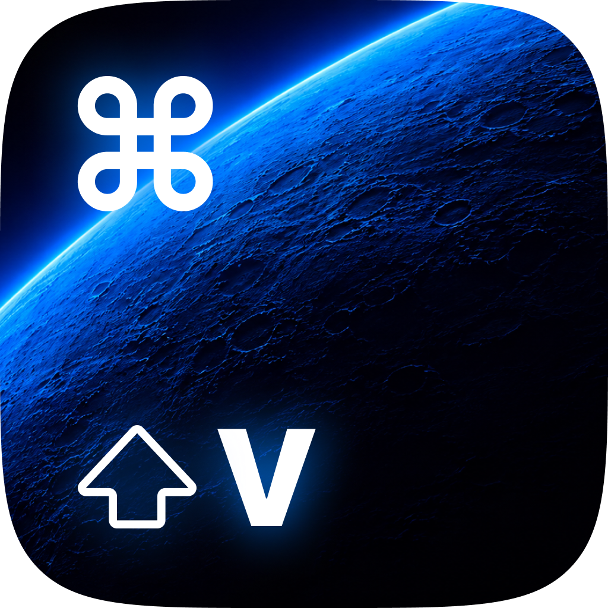

<div align="center">
  
  <h1>Revclip</h1>
  <p><strong>コピーしたものを、もう一度。自分に馴染むクリップボードを。</strong></p>
  <p>A native macOS clipboard manager. Local history. Reusable snippets. Yours to customize.</p>

  <a href="https://github.com/sasuketorii/rev_clip/releases/latest"></a>
  <a href="LICENSE"></a>
  
  
  
  <a href="https://github.com/sasuketorii/rev_clip/actions/workflows/ci.yml"></a>

  <p><strong>日本語</strong> · <a href="README.en.md">English</a></p>
  <p><a href="#はじめる">はじめる</a> · <a href="docs/CUSTOMIZATION.md">カスタマイズ</a> · <a href="CONTRIBUTING.md">開発に参加</a></p>
</div>

---

**⌘⇧Vで、履歴も、定型文も、設定も。** Revclipは、macOSのメニューバーに常駐するクリップボードマネージャーです。コピー履歴を辿り、テンプレートの内容をプレビューして、そのまま貼り付ける。いつもの作業を、ひとつのメニューから続けられます。

## 小さな構成で、日々のコピーを支える

| 特長 | 使い心地 |
| --- | --- |
| **macOSネイティブ** | AppKitの標準メニューとSwiftUI。ElectronやWebViewのランタイムを持ち込みません。 |
| **履歴はローカルに** | アカウント登録も、クラウドのセットアップも不要。履歴・テンプレートをMacに保存します。 |
| **10件ずつ、迷わず辿る** | 履歴は既定で10件ごとのフォルダに整理。件数やメニュー表示は設定できます。 |
| **繰り返す文章をテンプレートに** | フォルダで分類し、専用エディタで編集。インポート・エクスポートにも対応します。 |
| **貼る前に、内容が見える** | ホバーした項目をすばやくプレビュー。表示領域に余裕があればサブメニューの下に出します。 |
| **見た目も、自分に合わせる** | システム連動・ライト・ダークを設定から選択。さらにソースからUIを改造できます。 |

ネットワークは更新確認などに使用します。履歴をクラウド同期する機能はありません。

## プライバシーと負荷への配慮

- **保存するデータを選ぶ**: 機密・一時データとしてマークされたコピーを履歴に残さず、指定アプリを記録対象から除外できます。
- **ローカルデータを保護する**: クリップファイルのアクセス権を制限し、型を制限したデコードを使用します。保存データの暗号化や、マークのない秘密情報の自動判別を保証するものではありません。
- **変化があったときに処理する**: 監視では変更カウントを確認し、内容が変わっていなければ読み込みを省きます。保存時のアーカイブ変換は1回にまとめています。
- **データの増加を抑える**: 履歴件数とクリップの保存サイズを制限できます。保存サイズの制限は、実行中のピークメモリを保証する上限ではありません。

ネイティブUIと少ない依存を土台にした設計です。競合とのCPU・メモリ使用量の比較値は、まだ公開していません。

## 使い方

日本語・英語・韓国語・中国語（簡体字）・フランス語・ドイツ語・ポルトガル語（ブラジル）・イタリア語に対応。「設定 → 一般 → アプリの言語」で選択できます。変更はすぐに反映されます。「システムに従う」を選ぶとmacOSの優先言語を使用します。

1. Revclipを起動して、普段どおり文章などをコピーします。
2. **⌘⇧V**でメインメニューを開き、履歴またはテンプレートを選びます。
3. 元のアプリへ貼り付けます。自動ペーストを無効にすれば、クリップボードへのコピーだけにもできます。

| 入口 | 開くもの |
| --- | --- |
| **⌘⇧V** | 履歴・テンプレート・履歴消去・設定・テンプレート編集・終了 |
| **⌘⌃V** | 履歴とアプリ操作。テンプレートを含まないメニュー |
| **メニューバーのアイコン** | メインメニュー |

自動ペーストにはmacOSの「アクセシビリティ」の許可が必要です。ショートカットは設定から変更できます。

## はじめる

**[最新版のDMGをダウンロード](https://github.com/sasuketorii/rev_clip/releases/latest)** — Developer ID署名・Apple公証済み。Apple SiliconとIntelに対応したUniversalアプリです。DMGを開き、RevclipをApplicationsへ入れて起動してください。以降の更新はアプリ内から確認できます。

ソースからビルドしてカスタマイズする場合は、以下の手順を使ってください。

必要なものは、**Xcode 26.6**と**XcodeGen**。アプリの動作対象は**macOS 14以降**で、Apple Silicon・Intelに対応します。Debugビルドに有料のApple Developer契約は必要ありません。

```sh
git clone https://github.com/sasuketorii/rev_clip.git
cd rev_clip
brew install xcodegen
make -C src/Revclip setup
make -C src/Revclip debug
open src/Revclip/build/Debug/Revclip.app
```

Xcodeを初回起動して必要なコンポーネントを入れ、コマンドラインツールの参照先にXcodeを選んでください。既存のRevclipを使っている場合は終了してから開いてください。同じアプリIDのビルドは既存の設定・データを使用します。

```sh
# テスト
make -C src/Revclip test

# Xcodeで編集（project.ymlから生成したプロジェクト）
open src/Revclip/Revclip.xcodeproj
```

## 依存は、必要な役割に絞る

直接組み込むサードパーティの実行時依存は**2つ**です。どちらも同梱しているため、通常のビルドにCocoaPodsやSwift Package Managerでの取得は不要です。

| ライブラリ | 役割 | 同梱版 |
| --- | --- | --- |
| [FMDB](https://github.com/ccgus/fmdb) | macOSのSQLiteを扱うラッパー | 2.7.12 |
| [Sparkle](https://github.com/sparkle-project/Sparkle) | アプリの自動更新 | 2.9.6 |

この数にはmacOS標準フレームワーク、Sparkle内部の構成要素、開発ツールを含めません。XcodeGenはプロジェクト生成用、Pillowはアイコン再生成時のみ必要です。ライセンスの内訳は[第三者ライセンス](THIRD_PARTY_NOTICES.md)をご覧ください。

## あなたのUIで使ってください

メニューの情報量、プレビューの余白、エディタのレイアウト、アイコン。毎日使う道具だから、自分の好みに合わせて構いません。**MITライセンス**で、改変・再配布・商用利用ができます。著作権表示とライセンス文を保持してください。

| 変えたいところ | 入り口 |
| --- | --- |
| メニュー・履歴の構成 | [RCMenuManager.m](src/Revclip/Revclip/Managers/RCMenuManager.m) |
| プレビューの位置・表示タイミング | [RCFastPreviewController.m](src/Revclip/Revclip/UI/RCFastPreviewController.m) |
| ライト・ダークの適用 | [RCAppearanceController.swift](src/Revclip/Revclip/UI/Appearance/RCAppearanceController.swift) |
| テンプレートエディタ | [SnippetEditor](src/Revclip/Revclip/UI/SnippetEditor) |
| アプリの構成・ビルド設定 | [project.yml](src/Revclip/project.yml) |
| アイコン | [generate_icons.py](scripts/generate_icons.py) |

独自版を並行して使うときのデータ分離や更新配信の設定は、[カスタマイズガイド](docs/CUSTOMIZATION.md)にまとめています。バグ報告・改善のPRも歓迎します。

## ライセンス

[MIT](LICENSE) © sasuke torii and Revclip contributors. 同梱ライブラリには、それぞれのライセンスが適用されます。
